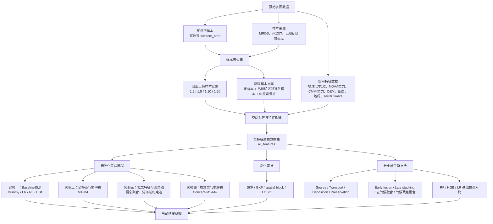

# 斑岩铜探矿、气象影响与因果图实验项目

本项目用于把斑岩铜矿点、负样本/中性样本、多源空间数据和 TerraClimate 气象数据统一对齐成建模数据集，并在同一数据基础上开展预测模型、气候解耦、概念特征、因果图、泛化审计和分支融合方法实验。

项目代码根目录：

```text
${CDMPM_PROJECT_ROOT}
```

项目数据根目录：

```text
${CDMPM_DATA_ROOT}
```

## 1. 当前研究主线

当前实验可以按四层理解：

| 层级 | 输入 | 输出 | 作用 |
|---|---|---|---|
| 样本构建层 | 正样本矿点、MRDS、州边界 | 样本点表、正负样本比例数据集、已知矿区邻近负样本与中性样本数据集 | 决定训练样本定义 |
| 空间对齐层 | 样本点 + 地球化学、地球物理、DEM、断层、地质、气象 | `model_dataset_*.csv/parquet` | 生成全特征建模表 |
| 标准实验层 | 任意 `model_dataset` | `outputs/standardized_runs/<数据集名>/` | baseline、气候解耦、概念因果图、概念气候解耦 |
| 扩展方法层 | 已构建数据集或概念特征 | 专项实验输出 | 泛化审计、分支融合、基础模型对比、方法对比 |

后续只要新样本表已经生成了 `model_dataset_*.csv/parquet`，就可以进入同一套标准实验和扩展方法实验，不需要每次重新写一套流程。

## 2. 当前实验流程图

下面流程图参考 `docs/当前实验流程图.md`，并补充了后续新增的已知矿区邻近负样本、中性样本和分支融合实验。



### 流程与实验对应关系

| 流程模块 | 对应实验 | 主要脚本/入口 | 主要输出 |
|---|---|---|---|
| 数据集构建 | 原始数据到全特征数据集 | `run_pipeline.ps1` | `outputs/model_datasets/`、`data_intermediate/` |
| 负样本比例构建 | 1:2、1:5、1:10、1:20 | `run_build_sample_scheme_datasets.ps1` | `outputs/model_datasets/by_sample_scheme/ratio_*/` |
| 新版样本方案 | 已知矿区邻近负样本 + 中性样本 | `run_known_mining_neutral_dataset.ps1` | `outputs/model_datasets/by_sample_scheme/known_mining_neutral/` |
| 实验一 | 全特征 baseline 预测 | `run_standard_dataset_workflow.ps1` | `01_baseline_models/` |
| 实验二 | 全特征气候解耦 M1-M4 | `run_standard_dataset_workflow.ps1` | `02_climate_decoupling/` |
| 实验三 | 概念特征与因果图 | `run_standard_causal_graph_workflow.ps1` | `03_causal_graph/` |
| 实验四 | 概念层气候解耦 | `run_concept_climate_decoupling.ps1` | `04_concept_climate_decoupling/` |
| 实验五 | 泛化与去区域化审计 | `run_generalization_audit.ps1` | `outputs/generalization_audit*/` |
| 实验六 | 分支融合新方法 | `run_branch_fusion_experiment.ps1` | `outputs/branch_fusion*/` |

## 3. 环境配置

首次运行：

```powershell
cd '${CDMPM_PROJECT_ROOT}'
.\setup_env.ps1
```

多数根目录 `run_*.ps1` 会自动调用 `.venv\Scripts\python.exe`。如果 `.venv` 不存在，会先调用 `setup_env.ps1` 创建环境。

## 4. 常用数据集

| 数据集 | 路径 | 说明 |
|---|---|---|
| 旧版 1:2 | `outputs/model_datasets/by_sample_scheme/ratio_1_2/model_dataset_western_core_ratio_1_2_all_features_v1.parquet` | 解释性较强，早期主线数据集 |
| 旧版 1:5 | `outputs/model_datasets/by_sample_scheme/ratio_1_5/model_dataset_western_core_ratio_1_5_all_features_v1.parquet` | 中等负样本比例 |
| 旧版 1:10 | `outputs/model_datasets/by_sample_scheme/ratio_1_10/model_dataset_western_core_ratio_1_10_all_features_v1.parquet` | 旧版主预测比例 |
| 旧版 1:20 | `outputs/model_datasets/by_sample_scheme/ratio_1_20/model_dataset_western_core_ratio_1_20_all_features_v1.parquet` | 高负样本压力测试 |
| 新版 1:2 监督数据集 | `outputs/model_datasets/by_sample_scheme/known_mining_neutral/known_mining_neutral_ratio_1_2/model_dataset_known_mining_neutral_ratio_1_2_supervised_all_features_v1.parquet` | 158 正样本 + 316 负样本 |
| 新版 1:2 含中性数据集 | `outputs/model_datasets/by_sample_scheme/known_mining_neutral/known_mining_neutral_ratio_1_2/model_dataset_known_mining_neutral_ratio_1_2_with_neutral_all_features_v1.parquet` | 158 正样本 + 316 负样本 + 316 中性样本 |
| 新版 1:5 监督数据集 | `outputs/model_datasets/by_sample_scheme/known_mining_neutral/known_mining_neutral_ratio_1_5/model_dataset_known_mining_neutral_ratio_1_5_supervised_all_features_v1.parquet` | 158 正样本 + 790 负样本 |
| 新版 1:5 含中性数据集 | `outputs/model_datasets/by_sample_scheme/known_mining_neutral/known_mining_neutral_ratio_1_5/model_dataset_known_mining_neutral_ratio_1_5_with_neutral_all_features_v1.parquet` | 158 正样本 + 790 负样本 + 790 中性样本 |
| 新版 1:10 监督数据集 | `outputs/model_datasets/by_sample_scheme/known_mining_neutral/known_mining_neutral_ratio_1_10/model_dataset_known_mining_neutral_ratio_1_10_supervised_all_features_v1.parquet` | 158 正样本 + 1580 负样本 |
| 新版 1:10 含中性数据集 | `outputs/model_datasets/by_sample_scheme/known_mining_neutral/known_mining_neutral_ratio_1_10/model_dataset_known_mining_neutral_ratio_1_10_with_neutral_all_features_v1.parquet` | 158 正样本 + 1580 负样本 + 1580 中性样本 |
| 新版 1:20 监督数据集 | `outputs/model_datasets/by_sample_scheme/known_mining_neutral/known_mining_neutral_ratio_1_20/model_dataset_known_mining_neutral_ratio_1_20_supervised_all_features_v1.parquet` | 158 正样本 + 3160 负样本 |
| 新版 1:20 含中性数据集 | `outputs/model_datasets/by_sample_scheme/known_mining_neutral/known_mining_neutral_ratio_1_20/model_dataset_known_mining_neutral_ratio_1_20_with_neutral_all_features_v1.parquet` | 158 正样本 + 3160 负样本 + 3160 中性样本 |

全特征数据集包含的主要字段前缀：

| 字段前缀 | 含义 |
|---|---|
| `geochem1_usgs_*` | 地球化学1，USGS parquet 数据 |
| `geochem2_nure_*` | 地球化学2，NURE 数据 |
| `gravity_na_*` | NOAA 基础重力 |
| `gravity_cmmi_*` | CMMI 重力派生数据 |
| `terrain_*` | DEM 地形特征 |
| `fault_*` | 断层距离、密度和长度 |
| `geology_*` | 地质图和岩性背景 |
| `climate_*` | TerraClimate 气象变量 |
| `env_*` | 环境分组、干旱度、雪影响等 |

## 5. 根目录运行入口

| 入口脚本 | 功能 | 常用输出 |
|---|---|---|
| `run_pipeline.ps1` | 从原始数据到基础全特征数据集的完整构建流程 | `data_intermediate/`、`outputs/model_datasets/` |
| `run_build_sample_scheme_datasets.ps1` | 构建 1:2、1:5、1:10、1:20 四套采样比例数据集 | `outputs/model_datasets/by_sample_scheme/ratio_*/` |
| `run_known_mining_neutral_dataset.ps1` | 构建新版“已知矿区邻近负样本 + 中性样本”数据集 | `outputs/model_datasets/by_sample_scheme/known_mining_neutral/` |
| `run_standard_dataset_workflow.ps1` | 对任意 `model_dataset` 跑 baseline 和 M1-M4 气候解耦 | `outputs/standardized_runs/<数据集名>/` |
| `run_standard_causal_graph_workflow.ps1` | 对任意 `model_dataset` 跑概念特征和因果图流程 | `outputs/standardized_runs/<数据集名>/03_causal_graph/` |
| `run_concept_climate_decoupling.ps1` | 对概念特征跑 Concept-M1 到 Concept-M4 | `outputs/standardized_runs/<数据集名>/04_concept_climate_decoupling/` |
| `run_generalization_audit.ps1` | 严格泛化、去区域化和空间分块审计 | `outputs/generalization_audit*/` |
| `run_branch_fusion_experiment.ps1` | 四分支融合新方法，支持 RF/HGB/LR 和中性样本训练 | `outputs/branch_fusion*/` |
| `run_negative_ratio_sensitivity.ps1` | 旧版负样本比例敏感性实验 | `outputs/negative_ratio_sensitivity/` |
| `run_mvp2_threshold_sensitivity.ps1` | 旧版 1:2 数据集 M4 阈值敏感性 | `outputs/decoupled_climate/` |
| `run_high_negative_m4_threshold_sensitivity.ps1` | 高负样本比例下 M4 阈值敏感性 | `outputs/decoupled_climate/` |
| `run_scheme_06_climate_ablation.ps1` | 方法对比方案六，气象变量消融 | `outputs/method_comparison/` |
| `run_stage_07_climate_decoupling.ps1` | 旧版气候解耦主流程 | `outputs/decoupled_climate/` |

## 6. 脚本阶段目录说明

脚本已按阶段归档到 `scripts/stage_*`。单独运行脚本时，优先使用根目录的 `run_*.ps1`；需要调试时再直接调用对应 Python 文件。

### stage_01_data_alignment

| 脚本 | 功能 |
|---|---|
| `00_check_environment.py` | 检查配置、依赖、原始数据路径和关键表头 |
| `01_prepare_mines.py` | 整理斑岩铜矿正样本 |
| `02_prepare_geochem2_nure.py` | 清洗 NURE 地球化学数据 |
| `03_prepare_geochem1_usgs.py` | 清洗 USGS 地球化学 parquet 数据 |
| `04_prepare_gravity.py` | 清洗 NOAA 重力点数据 |
| `05_spatial_align_features.py` | 对样本点做地球化学和基础重力邻域对齐 |
| `06_quality_report.py` | 生成数据对齐质量报告 |

### stage_02_sampling_and_region

| 脚本 | 功能 |
|---|---|
| `07_build_sample_table.py` | 构建旧版正负样本表 |
| `08_make_analysis_subsets.py` | 生成 western_core 等研究区子集 |
| `09_build_known_mining_neutral_dataset.py` | 构建新版已知矿区邻近负样本和中性样本数据集 |

### stage_03_feature_expansion

| 脚本 | 功能 |
|---|---|
| `11_align_terrain_geology.py` | 接入 DEM、断层和地质图特征 |
| `12_align_climate.py` | 接入 TerraClimate 气象特征 |
| `13_align_cmmi_gravity_derivatives.py` | 接入 CMMI 重力派生特征 |
| `14_make_environment_groups.py` | 生成干旱度、雪影响、地形起伏等环境分组 |

### stage_04_model_baseline

| 脚本 | 功能 |
|---|---|
| `09_make_model_dataset.py` | 生成最终 all-features 建模数据集 |
| `10_train_baseline.py` | 训练 Dummy、LR、RF、HistGradientBoosting baseline |

### stage_05_causal_graph

| 脚本 | 功能 |
|---|---|
| `15_create_feature_concept_mapping.py` | 把原始字段映射到概念变量 |
| `16_build_concept_features.py` | 聚合构建概念级特征表 |
| `17_train_concept_baseline.py` | 训练概念特征 baseline |
| `18_environment_stability_analysis.py` | 分环境变量稳定性分析 |
| `19_discover_environment_causal_graphs.py` | 分环境候选因果边发现 |
| `20_compare_cross_environment_edges.py` | 比较跨环境稳定边 |
| `21_build_causal_interpretation_graph.py` | 生成知识图谱式解释结构 |
| `40_run_standard_causal_graph_workflow.py` | 标准化因果图入口 |
| `41_run_concept_climate_decoupling.py` | 概念层气候解耦入口 |

### stage_06_method_comparison

| 脚本 | 功能 |
|---|---|
| `22_compare_ml_baselines.py` | 方法对比方案一，机器学习 baseline |
| `23_train_causal_core_baseline.py` | 方法对比方案二，因果核心特征 baseline |
| `24_run_mpm_weighted_overlay.py` | 方法对比方案三，传统 MPM/Fuzzy weighted overlay |
| `26_compare_causal_discovery_methods.py` | 方法对比方案四，PC-like、PC algorithm、GES/BIC |
| `25_compare_method_explanations.py` | 方法对比方案五，ML 重要性、MPM 权重、因果稳定边解释对比 |
| `27_climate_ablation_balanced_rf.py` | 方法对比方案六，Balanced RF 气象消融 |
| `28_climate_ablation_random_forest.py` | 方法对比方案六，普通 RF 气象消融 |

### stage_07_climate_decoupling

| 脚本 | 功能 |
|---|---|
| `29_define_decoupled_feature_roles.py` | 定义气候解耦中的字段角色 |
| `30_diagnose_element_climate_correlation.py` | 诊断元素与气候变量相关性 |
| `31_compare_climate_residual_models.py` | 比较 M1、M2、M3 |
| `32_leave_region_out_validation.py` | 留一州/留一环境验证 |
| `33_summarize_climate_decoupling_results.py` | 汇总气候解耦结果 |
| `34_mvp2_threshold_sensitivity.py` | M4 气候敏感阈值 0.2/0.3/0.4 对比 |
| `35_negative_ratio_sensitivity.py` | 负样本比例敏感性实验 |
| `36_high_negative_m4_threshold_sensitivity.py` | 高负样本比例下 M4 阈值敏感性 |
| `decoupling_utils.py` | 气候解耦公共工具 |

### stage_08_standard_workflow

| 脚本 | 功能 |
|---|---|
| `40_run_standard_dataset_workflow.py` | 读取任意 `model_dataset`，统一运行 baseline 和 M1-M4 气候解耦 |

### stage_09_generalization

| 脚本 | 功能 |
|---|---|
| `50_generalization_audit.py` | SKF、GKF、空间分块、LOSO 和特征消融审计 |

### stage_10_branch_fusion

| 脚本 | 功能 |
|---|---|
| `38_branch_fusion_negative_ratio_experiment.py` | Source、Transport、Deposition、Preservation 四分支融合实验，支持 RF/HGB/LR 和中性样本三类训练 |

## 7. 标准化实验流程

对任意建模数据集运行 baseline 和气候解耦：

```powershell
.\run_standard_dataset_workflow.ps1 --validation-mode core --datasets "${CDMPM_PROJECT_ROOT}\outputs\model_datasets\by_sample_scheme\ratio_1_10\model_dataset_western_core_ratio_1_10_all_features_v1.parquet"
```

`--validation-mode core` 运行：

| 验证方式 | 含义 |
|---|---|
| `stratified_kfold` | 分层随机交叉验证，偏同分布 |
| `groupkfold_state` | 按州分组交叉验证，检查跨州泛化 |

`--validation-mode exhaustive` 会额外运行留一州和留一环境组验证，耗时更长。

标准化输出目录：

```text
outputs/standardized_runs/<数据集名>/
```

| 子目录/文件 | 内容 |
|---|---|
| `00_dataset_profile/` | 样本规模、州分布、字段角色 |
| `01_baseline_models/` | Dummy、LR、RF、HistGradientBoosting |
| `02_climate_decoupling/` | M1-M4 气候解耦 |
| `standard_workflow_summary.csv` | 汇总表 |
| `standard_workflow_report.md` | 自动报告 |
| `standard_workflow_manifest.json` | 输入输出索引 |

## 8. Baseline 与气候解耦模型

### Baseline 模型

| 模型 | 目的 |
|---|---|
| DummyClassifier | 弱基线，确认模型是否明显强于随机 |
| Logistic Regression | 线性可解释基线 |
| Random Forest | 非线性树集成 baseline |
| HistGradientBoosting | 梯度提升树 baseline |

### 全特征气候解耦 M1-M4

| 方案 | 输入逻辑 | 目的 |
|---|---|---|
| M1 Full Climate | 非气候特征 + 气候特征 | 检查直接输入气候是否有帮助 |
| M2 No Climate | 移除气候变量 | 检查非气候探矿信号是否稳定 |
| M3 Full Residualized | 全量特征做气候残差化 | 检查全量校正是否过度 |
| M4 Sensitive Residualized | 只对气候敏感特征残差化 | 检查选择性气候校正 |

标准入口中的 M4 会在每个交叉验证 fold 的训练集内部重新计算 Spearman 相关并筛选气候敏感特征，默认：

```text
|Spearman r| >= 0.3
```

注意：这是残差化筛选阈值，不是最终分类概率阈值。F1、Precision、Recall 默认仍按预测正类概率 `>= 0.5` 计算。

## 9. 概念特征与因果图流程

运行：

```powershell
.\run_standard_causal_graph_workflow.ps1 --datasets "${CDMPM_PROJECT_ROOT}\outputs\model_datasets\by_sample_scheme\ratio_1_10\model_dataset_western_core_ratio_1_10_all_features_v1.parquet"
```

输出：

```text
outputs/standardized_runs/<数据集名>/03_causal_graph/
```

流程：

| 步骤 | 脚本 | 作用 |
|---|---|---|
| 1 | `15_create_feature_concept_mapping.py` | 字段映射到概念 |
| 2 | `16_build_concept_features.py` | 构建概念特征 |
| 3 | `17_train_concept_baseline.py` | 概念特征 baseline |
| 4 | `18_environment_stability_analysis.py` | 分环境稳定性 |
| 5 | `19_discover_environment_causal_graphs.py` | 分环境候选因果边 |
| 6 | `20_compare_cross_environment_edges.py` | 跨环境稳定边 |
| 7 | `21_build_causal_interpretation_graph.py` | 知识图谱式解释结构 |

概念特征常见节点：

```text
Cu_anomaly
Mo_anomaly
As_Sb_Bi_pathfinder
Pb_Zn_background
fault_density
fault_proximity
terrain_relief
terrain_slope
terrain_roughness
gravity_gradient
shallow_gravity_source_strength
water_deficit
snow_influence
aridity
```

## 10. 概念层气候解耦

运行：

```powershell
.\run_concept_climate_decoupling.ps1 --validation-mode core --datasets "${CDMPM_PROJECT_ROOT}\outputs\model_datasets\by_sample_scheme\ratio_1_10\model_dataset_western_core_ratio_1_10_all_features_v1.parquet"
```

输出：

```text
outputs/standardized_runs/<数据集名>/04_concept_climate_decoupling/
```

| 方案 | 含义 |
|---|---|
| Concept-M1 | 使用全部概念特征，包括气候概念 |
| Concept-M2 | 去掉气候概念 |
| Concept-M3 | 所有非气候概念对气候概念做残差化 |
| Concept-M4 | 只对气候敏感概念做残差化 |

概念层实验偏解释，不一定追求最高预测分数。

## 11. 新版样本方案：已知矿区邻近负样本与中性样本

运行：

```powershell
.\run_known_mining_neutral_dataset.ps1
```

输出：

```text
outputs/model_datasets/by_sample_scheme/known_mining_neutral/known_mining_neutral_ratio_1_10/
```

当前规则：

| 样本 | 标签 | 定义 |
|---|---:|---|
| 正样本 | `Y_label=1` | 斑岩铜 western_core 正样本 |
| 负样本 | `Y_label=0` | 已知非目标 MRDS 矿区附近点 |
| 中性样本 | `Y_label=-1` | 州边界内随机背景点，附近没有已知矿点 |

当前数量：

| 类型 | 数量 |
|---|---:|
| 正样本 | 158 |
| 负样本 | 1580 |
| 中性样本 | 1580 |
| 总计 | 3318 |

该方案会输出两类建模表：

| 文件 | 用途 |
|---|---|
| `*_supervised_all_features_v1.parquet/csv` | 只含正负样本，适合二分类 |
| `*_with_neutral_all_features_v1.parquet/csv` | 含正负中性样本，适合三类训练或中性样本排序 |

## 12. 分支融合新方法

分支融合方法把原始特征按成矿过程拆成四个分支：

| 分支 | 含义 | 典型字段 |
|---|---|---|
| Source | 源区和深部背景 | 重力、CMMI、岩性 |
| Transport | 运移和通道条件 | 断层、坡度、地形起伏 |
| Deposition | 沉淀和矿化异常 | Cu、Mo、Bi、As、Sb 等地球化学异常 |
| Preservation | 保存环境 | 气候、干旱度、雪影响、风化环境 |

相关文件：

| 文件 | 作用 |
|---|---|
| `scripts/stage_10_branch_fusion/38_branch_fusion_negative_ratio_experiment.py` | 分支融合主脚本 |
| `config/feature_branches/feature_branch_assignment.json` | 字段到四分支的映射 |
| `run_branch_fusion_experiment.ps1` | 运行入口 |
| `docs/分支融合新方法实验说明.md` | 结构和结果说明 |
| `docs/分支融合基础模型对比结果.md` | RF、HGB、LR 对比结果 |

### 12.1 二分类训练

```powershell
.\run_branch_fusion_experiment.ps1 -Datasets '.\outputs\model_datasets\by_sample_scheme\known_mining_neutral\known_mining_neutral_ratio_1_10\model_dataset_known_mining_neutral_ratio_1_10_supervised_all_features_v1.csv' -OutputRoot '.\outputs\branch_fusion_experiments'
```

### 12.2 加入中性样本的三类训练

```powershell
.\run_branch_fusion_experiment.ps1 -IncludeNeutral -Datasets '.\outputs\model_datasets\by_sample_scheme\known_mining_neutral\known_mining_neutral_ratio_1_10\model_dataset_known_mining_neutral_ratio_1_10_with_neutral_all_features_v1.csv' -OutputRoot '.\outputs\branch_fusion_experiments_with_neutral'
```

三类训练时，模型学习 `1 / 0 / -1` 三个标签；评估仍然按 `Y_label=1` 正样本 vs 其他样本计算。

### 12.3 切换基础模型

```powershell
.\run_branch_fusion_experiment.ps1 -IncludeNeutral -BaseModel hist_gradient_boosting -NEstimators 200 -Datasets '.\outputs\model_datasets\by_sample_scheme\known_mining_neutral\known_mining_neutral_ratio_1_10\model_dataset_known_mining_neutral_ratio_1_10_with_neutral_all_features_v1.csv' -OutputRoot '.\outputs\branch_fusion_model_comparison_with_neutral'

.\run_branch_fusion_experiment.ps1 -IncludeNeutral -BaseModel logistic_regression -Datasets '.\outputs\model_datasets\by_sample_scheme\known_mining_neutral\known_mining_neutral_ratio_1_10\model_dataset_known_mining_neutral_ratio_1_10_with_neutral_all_features_v1.csv' -OutputRoot '.\outputs\branch_fusion_model_comparison_with_neutral'
```

当前结果摘要：

| 对比口径 | 最好方案 | 结果 |
|---|---|---|
| 二分类 GKF AUC | M1 Full RF | 0.9550 |
| 二分类 GKF F1 | M12 NoClimate LateFusion | 0.6150 |
| 三类训练 GKF AUC | RF + M11 NoClimate EarlyFusion | 0.9749 |
| 三类训练 GKF F1 | RF + M12 NoClimate LateFusion | 0.5680 |
| 基础模型对比 GKF AUC | RF 最强 | 最高 0.9749 |
| 基础模型对比固定阈值 F1 | HGB + M5 Deposition Only 最强 | 0.5943 |

加入中性样本后，AUC 普遍上升，但固定 `0.5` 阈值下 F1 容易下降。后续如果采用三类训练，应增加阈值校准。

## 13. 泛化审计

运行：

```powershell
.\run_generalization_audit.ps1 --models hist_gradient_boosting random_forest --max-splits 3 --feature-sets all_features no_climate_no_location core_geo_geochem_geophysics concept_all concept_no_climate --datasets "${CDMPM_PROJECT_ROOT}\outputs\model_datasets\by_sample_scheme\ratio_1_10\model_dataset_western_core_ratio_1_10_all_features_v1.parquet"
```

输出：

```text
outputs/generalization_audit*
```

主要比较：

| 验证 | 目的 |
|---|---|
| SKF | 同分布参考 |
| GKF by state | 跨州泛化 |
| spatial block | 空间泛化 |
| LOSO | 留一州严格诊断 |
| no climate / no location | 检查模型是否过度依赖气候或位置 |
| concept features | 检查概念特征解释性能 |

## 14. 当前结果阅读口径

目前建议按下面方式读结果：

1. **预测性能**：优先看 `groupkfold_state` 下的 AUC、AP、F1 和 Balanced Accuracy。
2. **正样本识别**：负样本很多时，F1、AP / PR-AUC 比 ROC-AUC 更贴近探矿任务。
3. **气候影响**：比较 M1、M2、M3、M4，不要只看单个模型分数。
4. **中性样本训练**：AUC 上升不等于固定阈值可直接使用，需要阈值校准。
5. **因果解释**：看稳定概念、跨环境稳定边和多方法一致性，不只看预测分数。
6. **分支融合**：RF 排序能力强，HGB 固定阈值 F1 有优势，LR 适合作为线性基线。

## 15. 关键术语与指标

### 样本术语

| 名称 | 含义 |
|---|---|
| 正样本 / Positive | `Y_label=1`，斑岩铜矿点 |
| 负样本 / Negative | `Y_label=0`，已知非目标矿区附近点或旧版 hard negative |
| 中性样本 / Neutral | `Y_label=-1`，未知背景点，不直接等同于负样本 |
| hard negative | 难负样本，与矿业活动或地质背景较接近，但不是目标矿种 |
| western_core | 当前美国西部核心研究区，已剔除阿拉斯加 |

### 验证方式

| 缩写 | 全称 | 含义 |
|---|---|---|
| SKF | Stratified K-Fold | 分层随机 K 折，偏同分布 |
| GKF | Group K-Fold | 分组 K 折，本项目主要按州分组 |
| LOSO | Leave-One-State-Out | 留一州验证 |
| spatial block CV | 空间分块交叉验证 | 检查空间邻近记忆 |

### 模型缩写

| 缩写 | 含义 |
|---|---|
| LR | Logistic Regression |
| RF | Random Forest |
| HGB / Hist | HistGradientBoosting |
| MPM | Mineral Prospectivity Mapping |
| PC | Peter-Clark causal discovery algorithm |
| GES | Greedy Equivalence Search |
| BIC | Bayesian Information Criterion |

### 评价指标

| 指标 | 含义 | 解读 |
|---|---|---|
| ROC-AUC | ROC 曲线下面积 | 随机正负样本对中，正样本得分更高的概率；看排序能力 |
| PR-AUC / AP | Precision-Recall 曲线或平均精确率 | 更关注正样本识别，适合稀有正样本任务 |
| Balanced Accuracy | 正类召回率和负类召回率的平均 | 适合类别不平衡 |
| Precision | 预测为矿点的样本中真正为矿点的比例 | 越高误报越少 |
| Recall | 真实矿点中被找出的比例 | 越高漏报越少 |
| F1 | Precision 和 Recall 的调和平均 | 固定阈值下综合看准和找全 |
| MCC | Matthews Correlation Coefficient | 不平衡分类较稳，范围 -1 到 1 |

常见误读：

```text
ROC-AUC 高：排序能力强，但不代表 0.5 阈值下 F1 一定高。
AP / PR-AUC 高：正样本识别质量较好，更适合探矿任务。
F1 高：当前阈值下 Precision 和 Recall 更平衡。
加入中性样本后 AUC 高、F1 低：可能需要阈值校准，而不是说明模型没学到。
```

## 16. 重要文档索引

| 文档 | 内容 |
|---|---|
| `docs/当前实验流程图.md` | 当前实验组合流程图 |
| `docs/标准化实验流程说明.md` | 标准化实验入口说明 |
| `docs/四个负样本比例标准流程结果检查.md` | 四个比例数据集结果汇总 |
| `docs/已知矿区邻近负样本与中性样本数据集说明.md` | 新版样本方案说明 |
| `docs/已知矿区邻近负样本训练结果.md` | 新版监督数据集训练结果 |
| `docs/概念特征气象解耦实验结果.md` | 概念层气候解耦结果 |
| `docs/严格泛化与去区域化审计_1比10结果.md` | 泛化审计结果 |
| `docs/分支融合新方法实验说明.md` | 分支融合方法说明 |
| `docs/分支融合基础模型对比结果.md` | RF、HGB、LR 对比 |
| `docs/中性样本四分支比例实验结果.md` | 中性样本 1:2、1:5、1:10、1:20 四分支比例对比 |
| `docs/四分支监督训练与中性样本训练对比.md` | 中性样本不参与训练 vs 三类训练的四分支结果对比 |
| `docs/M4与四分支M12结果差异说明.md` | 标准气候解耦 M4 与四分支 M12 的差异和统一解释 |
| `docs/方法对比实验设计.md` | 方法对比方案设计 |
